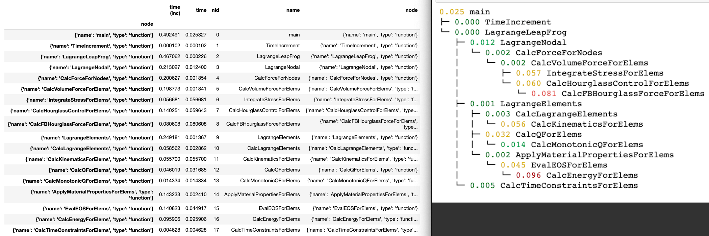

Hatchet
=======

[](https://travis-ci.com/LLNL/hatchet)
[](http://hatchet.readthedocs.io)

Hatchet analyzes performance data that is organized in a tree hierarchy (such
as calling context trees, call graphs, nested regions' timers etc.)

[](https://raw.githubusercontent.com/LLNL/hatchet/master/screenshot.jpg)

### Running hatchet

To use hatchet, add the cloned directory to your PYTHONPATH.

### Copyright

```
Copyright (c) 2017-2018, Lawrence Livermore National Security, LLC.
Produced at the Lawrence Livermore National Laboratory.

Created by Abhinav Bhatele <bhatele@llnl.gov>.
LLNL-CODE-741008. All rights reserved.
```
