.. Copyright 2020-2021 University of Maryland and other Hatchet Project
   Developers. See the top-level LICENSE file for details.

   SPDX-License-Identifier: MIT

*****************
Analysis Examples
*****************

Reading different file formats
==============================

Hatchet can read in a variety of data file formats into a GraphFrame. Below, we
show examples of reading in different data formats.

Read in an HPCToolkit database
------------------------------

A database directory is generated by using ``hpcprof-mpi`` to post-process the
raw measurements directory output by `HPCToolkit
<http://hpctoolkit.org/index.html>`_. To analyze an HPCToolkit database, the
``from_hpctoolkit`` method can be used.

.. literalinclude:: examples/read/hpctoolkit.py
    :language: python

Read in a Caliper cali file
---------------------------

`Caliper <http://software.llnl.gov/Caliper/>`_'s default raw performance data
output is the `cali <http://llnl.github.io/Caliper/OutputFormats.html#cali>`_.
The cali format can be read by ``cali-query``, which transforms the raw data into
JSON format.

.. literalinclude:: examples/read/caliper_cali.py
    :language: python

Read in a Caliper JSON stream or file
-------------------------------------

`Caliper <http://software.llnl.gov/Caliper/>`_'s `json-split
<http://software.llnl.gov/Caliper/OutputFormats.html#json-split>`_ format
writes a JSON file with separate fields for Caliper records and metadata. The
json-split format is generated by either running ``cali-query`` on the raw
Caliper data or by enabling the ``mpireport`` service when using Caliper.

JSON Stream
^^^^^^^^^^^

.. literalinclude:: examples/read/caliper_cali_to_json.py
    :language: python

JSON File
^^^^^^^^^

.. literalinclude:: examples/read/caliper_json.py
    :language: python

Read in a DOT file
------------------

The `DOT <https://www.graphviz.org/doc/info/lang.html>`_ file format is
generated by using ``gprof2dot`` on ``gprof`` or ``callgrind`` output.

.. literalinclude:: examples/read/gprof_dot.py
    :language: python

Read in a DAG literal
---------------------

The literal format is a list of dictionaries representing a graph with nodes
and metrics.

.. literalinclude:: examples/read/dag_literal.py
    :language: python

Basic Examples
==============

Applying scalar operations to attributes
----------------------------------------

Individual numeric columns in the dataframe can be scaled or offset by a
constant using the native pandas operations. We make a copy of the original
graphframe, and modify the dataframe directly. In this example, we offset the
``time`` column by -2 and scale it by 1/1e7, storing the result in a new column
in the dataframe called ``scaled time``.

.. code-block:: python

  gf = ht.GraphFrame.from_hpctoolkit('kripke')
  gf.drop_index_levels()

  offset = 1e7
  gf.dataframe['scaled time'] = (gf.dataframe['time'] / offset) - 2
  sorted_df = gf.dataframe.sort_values(by=['scaled time'], ascending=False)
  print(sorted_df)

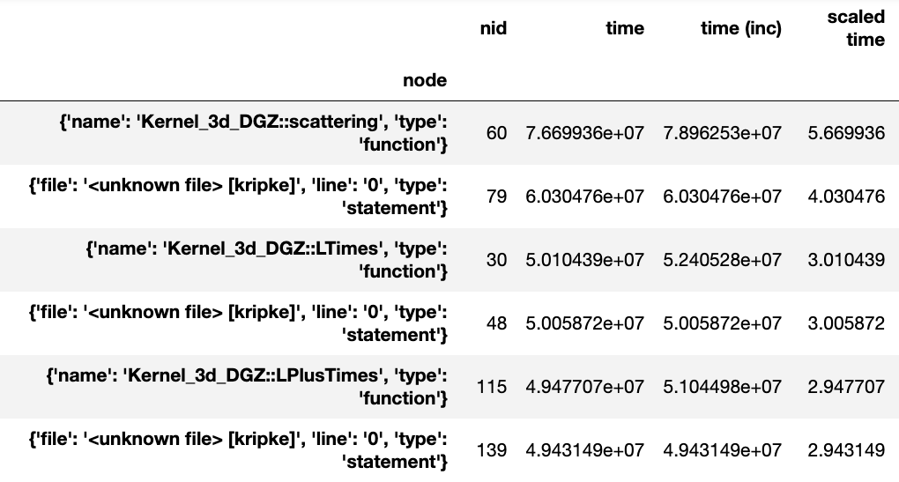

Generating a flat profile
-------------------------

We can generate a flat profile in hatchet by using the ``groupby``
functionality in pandas. The flat profile can be based on any categorical
column (e.g., function name, load module, file name). We can transform the tree
or graph generated by a profiler into a flat profile by specifying the column
on which to apply the ``groupby`` operation and the function to use for
aggregation.

In the example below, we apply a pandas ``groupby`` operation on the ``name``
column. The time spent in each function is computed using ``sum`` to aggregate
rows in a group. We then display the resulting DataFrame sorted by time.

.. code-block:: python

  # Read in Kripke HPCToolkit database.
  gf = ht.GraphFrame.from_hpctoolkit('kripke')

  # Drop all index levels in the DataFrame except ``node``.
  gf.drop_index_levels()

  # Group DataFrame by ``name`` column, compute sum of all rows in each
  # group. This shows the aggregated time spent in each function.
  grouped = gf.dataframe.groupby('name').sum()

  # Sort DataFrame by ``time`` column in descending order.
  sorted_df = grouped.sort_values(by=['time'],
                                  ascending=False)

  # Display resulting DataFrame.
  print(sorted_df)

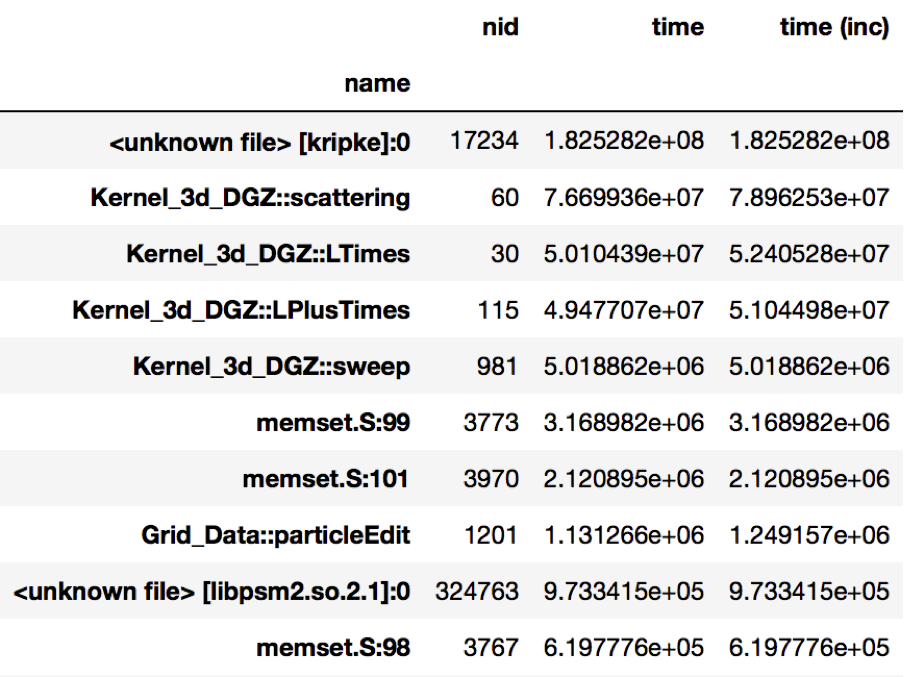

   Figure 1: Resulting DataFrame after performing a groupby on the ``name``
   column in this HPCToolkit dataset (only showing a handful of rows for
   brevity). The DataFrame is sorted in descending order by the ``time`` column
   to show the function name with the biggest execution time.

Identifying load imbalance
--------------------------

Hatchet makes it extremely easy to study load imbalance across processes or
threads at the per-node granularity (call site or function level). A typical
metric to measure imbalance is to look at the ratio of the maximum and average
time spent in a code region across all processes.

In this example, we ran LULESH across 512 cores, and are interested in
understanding the imbalance across processes. We first perform a
``drop_index_levels`` operation on the GraphFrame in two different ways: (1) by
providing mean as a function in one case, and (2) max as the function to
another copy of the DataFrame. This generates two DataFrames, one containing
the average time spent in each node, and the other containing the maximum time
spent in each node by any process. If we divide the corresponding columns of
the two DataFrames and look at the nodes with the highest value of the
max-to-average ratio, we can identify the nodes with highest imbalance.

.. code-block:: python

  # Read in LULESH Caliper dataset.
  gf1 = ht.GraphFrame.from_caliper('lulesh-512cores')

  # Create a copy of the GraphFrame.
  gf2 = gf1.copy()

  # Drop all index levels in gf1's DataFrame except ``node``, computing the
  # average time spent in each node.
  gf1.drop_index_levels(function=np.mean)

  # Drop all index levels in a copy of gf1's DataFrame except ``node``, this
  # time computing the max time spent in each node.
  gf2.drop_index_levels(function=np.max)

  # Compute the imbalance by dividing the ``time`` column in the max DataFrame
  # (i.e., gf2) by the average DataFrame (i.e., gf1). This creates a new column
  # called ``imbalance`` in gf1's DataFrame.
  gf1.dataframe['imbalance'] = gf2.dataframe['time'].div(gf1.dataframe['time'])

  # Sort DataFrame by ``imbalance`` column in descending order.
  sorted_df = gf1.dataframe.sort_values(by=['imbalance'], ascending=False)

  # Display resulting DataFrame.
  print(sorted_df)

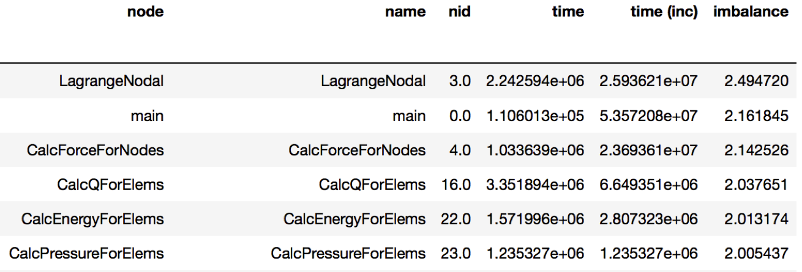

   Figure 2: Resulting DataFrame showing the imbalance in this Caliper dataset
   (only showing a handful of rows for brevity). The DataFrame is sorted in
   descending order by the new ``imbalance`` column calculated by dividing the
   max/average time of each function. The function with the highest level of
   imbalance within a node is ``LagrangeNodal`` with an imbalance of 2.49.

Comparing multiple executions
-----------------------------

An important task in parallel performance analysis is comparing the performance
of an application on two different thread counts or process counts. The
``filter``, ``squash``, and ``subtract`` operations provided by the Hatchet API
can be extremely powerful in comparing profiling datasets from two executions.

In the example below, we ran LULESH at two core counts: 1 core and 27 cores,
and wanted to identify the performance changes as one scales on a node. We
subtract the GraphFrame at 27 cores from the GraphFrame at 1 core (after
dropping the additional index levels), and sort the resulting GraphFrame by
execution time.

.. code-block:: python

  # Read in LULESH Caliper dataset at 1 core.
  gf1 = ht.GraphFrame.from_caliper('lulesh-1core.json')

  # Read in LULESH Caliper dataset at 27 cores.
  gf2 = ht.GraphFrame.from_caliper('lulesh-27cores.json')

  # Drop all index levels in gf2's DataFrame except ``node``.
  gf2.drop_index_levels()

  # Subtract the GraphFrame at 27 cores from the GraphFrame at 1 core, and
  # store result in a new GraphFrame.
  gf3 = gf2 - gf1

  # Sort resulting DataFrame by ``time`` column in descending order.
  sorted_df = gf3.dataframe.sort_values(by=['time'], ascending=False)

  # Display resulting DataFrame.
  print(sorted_df)

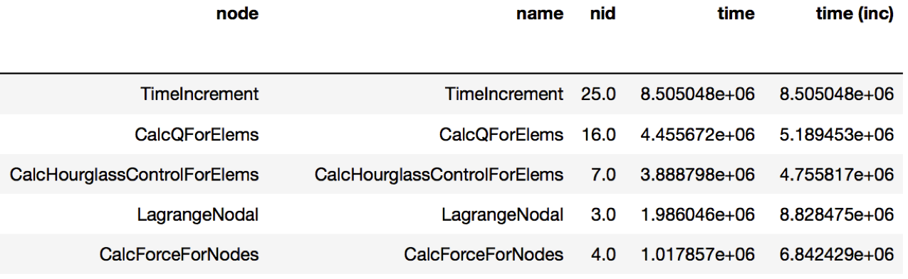

   Figure 3: Resulting DataFrame showing the performance differences when
   running LULESH at 1 core vs. 27 cores (only showing a handful of rows for
   brevity). The DataFrame sorts the function names in descending order by the
   ``time`` column. The ``TimeIncrement`` has the largest difference in
   execution time of 8.5e6 as the code scales from 1 to 27 cores.

Filtering by library
--------------------

Sometimes, users are interested in analyzing how a particular library, such as
PetSc or MPI, is used by their application and how the time spent in the
library changes as we scale to a larger number of processes.

In this next example, we compare two datasets generated from executions at
different numbers of MPI processes. We read in two datasets of LULESH at 27 and
512 MPI processes, respectively, and filter them both on the ``name`` column by
matching the names against ``^MPI``. After the filtering operation, we
``squash`` the DataFrames to generate GraphFrames that just contain the MPI
calls from the original datasets. We can now subtract the squashed datasets to
identify the biggest offenders.

.. code-block:: python

  # Read in LULESH Caliper dataset at 27 cores.
  gf1 = GraphFrame.from_caliper('lulesh-27cores')

  # Drop all index levels in DataFrame except ``node``.
  gf1.drop_index_levels()

  # Filter GraphFrame by names that start with ``MPI``. This only filters the #
  # DataFrame. The Graph and DataFrame are now out of sync.
  filtered_gf1 = gf1.filter(lambda x: x['name'].startswith('MPI'))

  # Squash GraphFrame, the nodes in the Graph now match what's in the
  # DataFrame.
  squashed_gf1 = filtered_gf1.squash()

  # Read in LULESH Caliper dataset at 512 cores, drop all index levels except
  # ``node``, filter and squash the GraphFrame, leaving only nodes that start
  # with ``MPI``.
  gf2 = GraphFrame.from_caliper('lulesh-512cores')
  gf2.drop_index_levels()
  filtered_gf2 = gf2.filter(lambda x: x['name'].startswith('MPI'))
  squashed_gf2 = filtered_gf2.squash()

  # Subtract the two GraphFrames, store the result in a new GraphFrame.
  diff_gf = squashed_gf2 - squashed_gf1

  # Sort resulting DataFrame by ``time`` column in descending order.
  sorted_df = diff_gf.dataframe.sort_values(by=['time'], ascending=False)

  # Display resulting DataFrame.
  print(sorted_df)

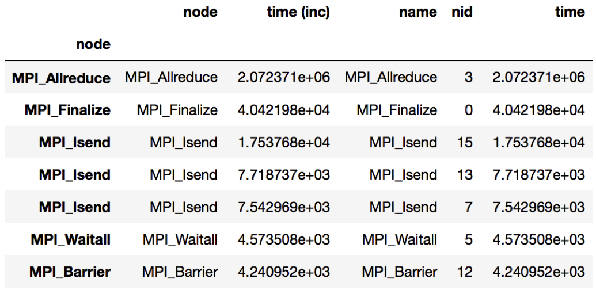

   Figure 4: Resulting DataFrame showing the MPI performance differences when
   running LULESH at 27 cores vs. 512 cores. The DataFrame sorts the MPI
   functions in descending order by the ``time`` column. In this example, the
   ``MPI_Allreduce`` function sees the largest increase in time scaling from 27
   to 512 cores.

Scaling Performance Examples
============================

Analyzing strong scaling performance
------------------------------------

Hatchet can be used for a strong scaling analysis of applications.  In this
example, we compare the performance of LULESH running on 1 and 64 cores.
By executing a simple ``divide`` of the two datasets in Hatchet, we can quickly
pinpoint bottleneck functions. In the resulting graph, we invert the color
scheme, so that functions that did not scale well (i.e., have a low speedup)
are colored in red.

.. code-block:: python

  gf_1core = ht.GraphFrame.from_caliper('lulesh*-1core.json')
  gf_64cores = ht.GraphFrame.from_caliper('lulesh*-64cores.json')

  gf_64cores["time"] *= 64

  gf_strong_scale = gf_1core / gf_64cores

|pic1| / |pic2| = |pic3|

.. |pic1| image:: images/strong-scale-graph1.png
   :scale: 30 %

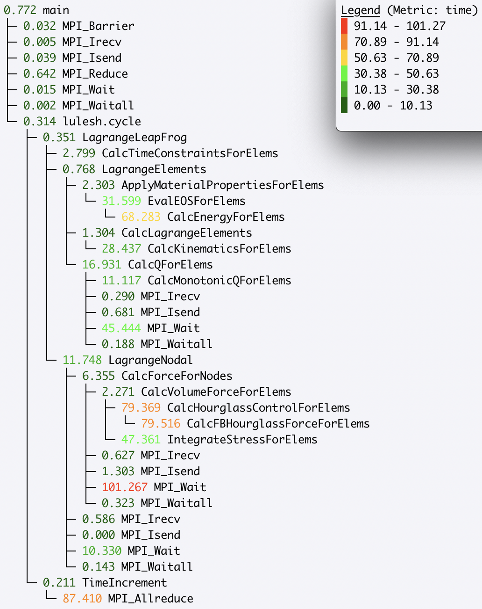

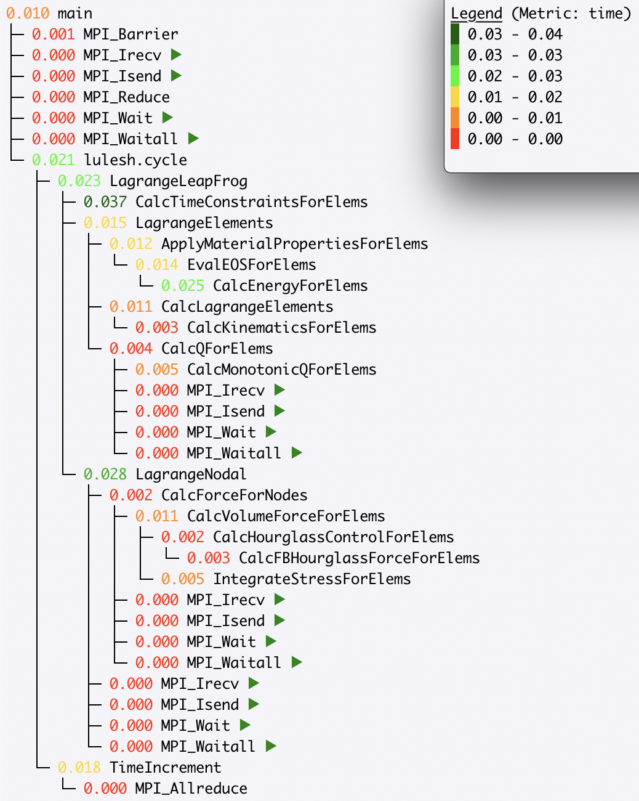

Analyzing weak scaling performance
----------------------------------

Hatchet can be used for comparing parallel scaling performance of applications.
In this example, we compare the performance of LULESH running on 1 and 27 cores.
By executing a simple ``divide`` of the two datasets in Hatchet, we can quickly
identify which function calls did or did not scale well. In the resulting
graph, we invert the color scheme, so that functions that did not scale well
(i.e., have a low speedup) are colored in red.

.. code-block:: python

  gf_1core = ht.GraphFrame.from_caliper('lulesh*-1core.json')
  gf_27cores = ht.GraphFrame.from_caliper('lulesh*-27cores.json')

  gf_weak_scale = gf_1core / gf_27cores

|pic4| / |pic5| |pic6| =

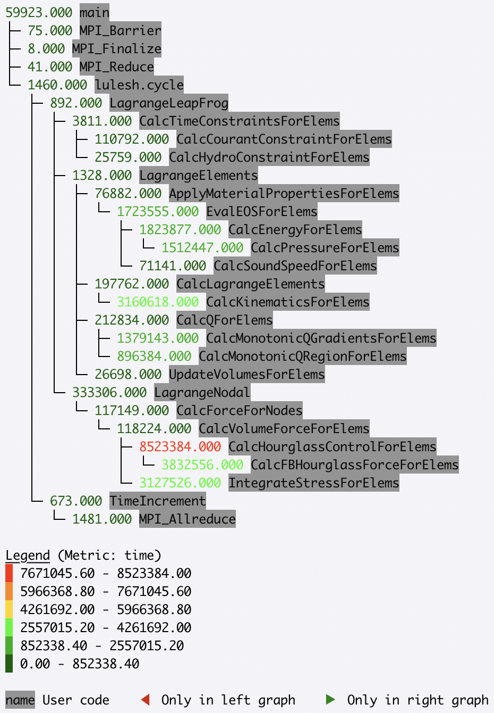

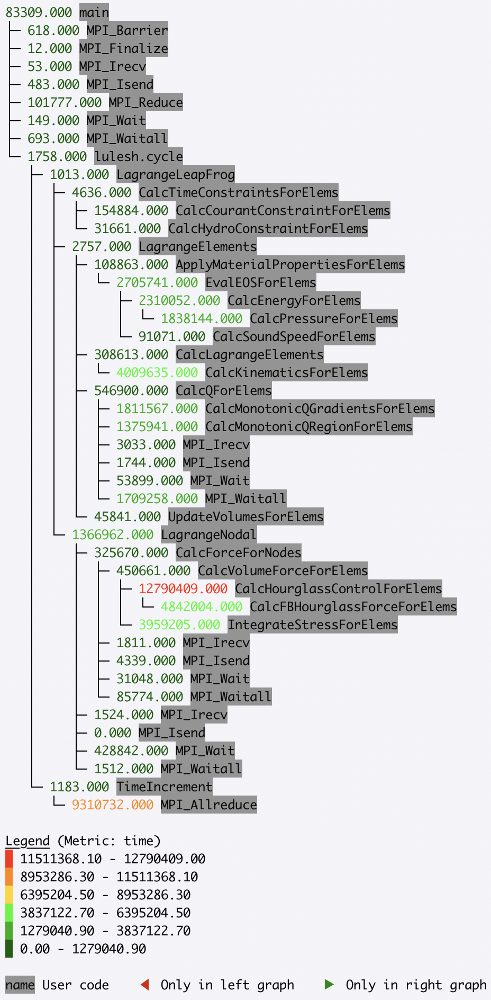

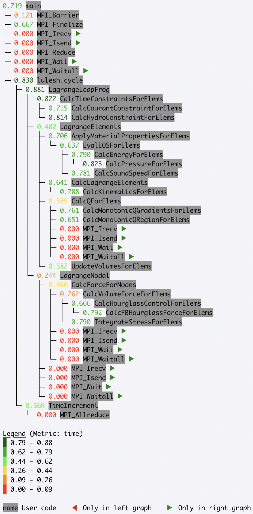

Identifying scaling bottlenecks
-------------------------------

Hatchet can also be used to analyze data in a weak or strong scaling
performance study. In this example, we ran LULESH from 1 to 512 cores on third
powers of some numbers. We read in all the datasets into Hatchet, and for each
dataset, we use a few lines of code to filter the regions where the code spends
most of the time. We then use the pandas' pivot and plot operations to generate
a stacked bar chart that shows how the time spent in different regions of
LULESH changes as the code scales.

.. code-block:: python

  # Grab all LULESH Caliper datasets, store in a sorted list.
  datasets = glob.glob('lulesh*.json')
  datasets.sort()

  # For each dataset, create a new GraphFrame, and drop all index levels,
  # except ``node``. Insert filtered graphframe into a list.
  dataframes = []
  for dataset in datasets:
      gf = ht.GraphFrame.from_caliper(dataset)
      gf.drop_index_levels()

      # Grab the number of processes from the file name, store this as a new
      # column in the DataFrame.
      num_pes = re.match('(.*)-(\d+)(.*)', dataset).group(2)
      gf.dataframe['pes'] = num_pes

      # Filter the GraphFrame keeping only those rows with ``time`` greater
      # than 1e6.
      filtered_gf = gf.filter(lambda x: x['time'] > 1e6)

      # Insert the filtered GraphFrame into a list.
      dataframes.append(filtered_gf.dataframe)

  # Concatenate all DataFrames into a single DataFrame called ``result``.
  result = pd.concat(dataframes)

  # Reshape the Dataframe, such that ``pes`` is an index column, ``name``
  # fields are the new column names, and the values for each cell is the
  # ``time`` fields.
  pivot_df = result.pivot(index='pes', columns='name', values='time')

  # Make a stacked bar chart using the data in the pivot table above.
  pivot_df.loc[:,:].plot.bar(stacked=True, figsize=(10,7))

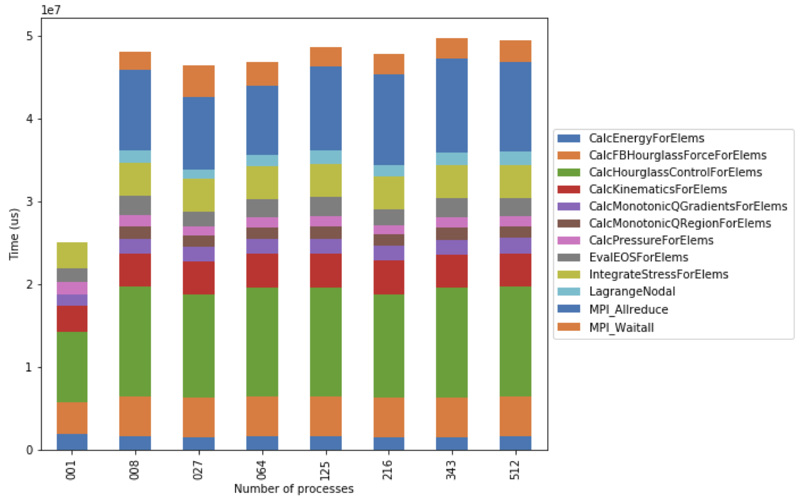

   Figure 5: Resulting stacked bar chart showing the time spent in different
   functions in LULESH as the code scales from 1 up to 512 processes. In this
   example, the ``CalcHourglassControlForElems`` function increases in runtime
   moving from 1 to 8 processes, then stays constant.

We use the same LULESH scaling datasets above to filter for time-consuming
functions that start with the string ``Calc``. This data is used to produce a
line chart showing the performance of each function as the number of processes
is increased. One of the functions (``CalcMonotonicQRegionForElems``) does not
occur until the number of processes is greater than 1.

.. code-block:: python

  datasets = glob.glob('lulesh*.json')
  datasets.sort()

  dataframes = []
  for dataset in datasets:
      gf = ht.GraphFrame.from_caliper(dataset)
      gf.drop_index_levels()

      num_pes = re.match('(.*)-(\d+)(.*)', dataset).group(2)
      gf.dataframe['pes'] = num_pes
      filtered_gf = gf.filter(lambda x: x["time"] > 1e6 and x["name"].startswith('Calc'))
      dataframes.append(filtered_gf.dataframe)

  result = pd.concat(dataframes)
  pivot_df = result.pivot(index='pes', columns='name', values='time')
  pivot_df.loc[:,:].plot.line(figsize=(10, 7))

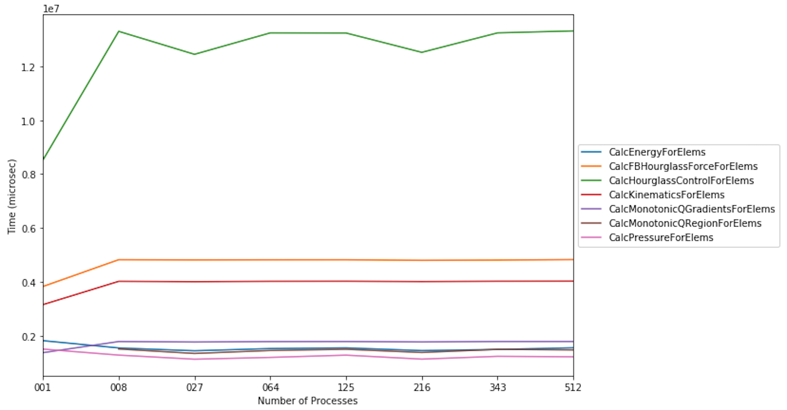
