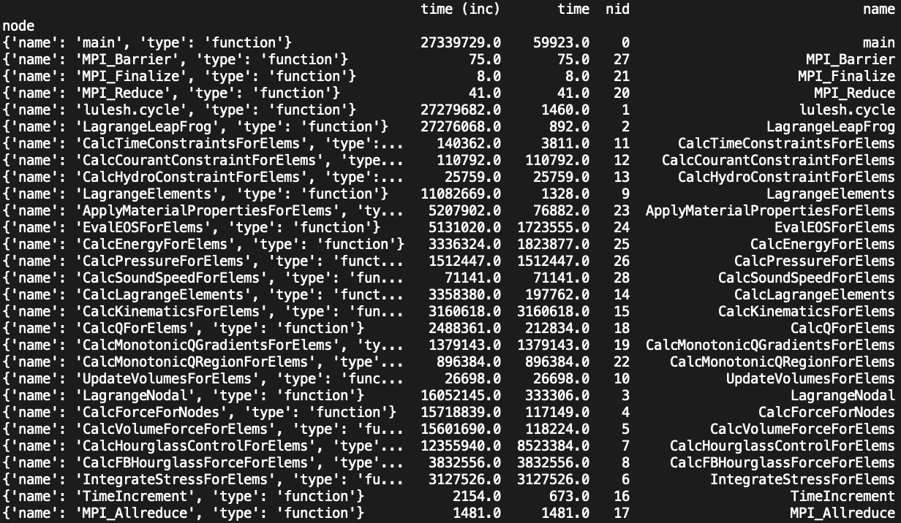
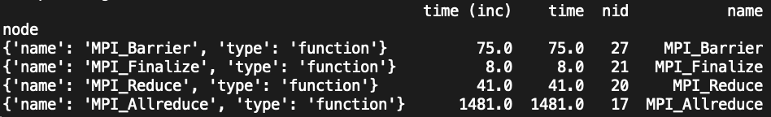
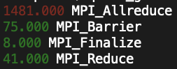

.. Copyright 2020 University of Maryland and other Hatchet Project
   Developers. See the top-level LICENSE file for details.

   SPDX-License-Identifier: MIT

Basic Tutorial: Hatchet 101
===========================

This tutorial introduces how to use hatchet, including basics about:

* Using the pandas API
* Using the hatchet API
* Generating data for hatchet

Installing Hatchet and Tutorial Setup
-------------------------------------

You can install hatchet using pip:

.. code-block:: console

  $ pip install hatchet

After installing hatchet, you can import hatchet when running the Python
interpreter in interactive mode:

.. code-block:: console

  $ python
  Python 3.7.7 (default, Mar 14 2020, 02:39:01)
  [Clang 10.0.1 (clang-1001.0.46.4)] on darwin
  Type "help", "copyright", "credits" or "license" for more information.
  >>>

Typing ``import hatchet`` at the prompt should succeed without any error
messages:

.. code-block:: console

  >>> import hatchet as ht
  >>>

You are good to go!

The Hatchet repository includes standalone Python-based Jupyter notebook examples based on this
tutorial.
You can find them in the hatchet `GitHub repository
<https://github.com/LLNL/hatchet/tree/develop/docs/examples>`_. You can get a local copy of the repository using ``git``:

.. code-block:: console

  $ git clone https://github.com/LLNL/hatchet.git

You will the tutorial notebooks in your local hatchet repository under
``examples/tutorial/``.

Introduction
------------

You can read in a dataset into Hatchet for analysis by using one of several
``from_`` static methods. You can read in a Caliper JSON file as follows:

.. code-block:: console

  >>> import hatchet as ht
  >>> caliper_file = 'lulesh-annotation-profile-1core.json'
  >>> gf = ht.GraphFrame.from_caliper_json(caliper_file)
  >>>

At this point, your input file (profile) has been loaded into hatchet data
structures as a pandas data frame and a corresponding graph.

The pandas DataFrame component of Hatchet's GraphFrame contains the metrics and
other non-numeric data associated with each node in the dataset.  You can print
the dataframe by typing:

.. code-block:: console

  >>> print(gf.dataframe)

This should produce output like this:

.. figure:: images/basic-tutorial/01-dataframe.png
   :scale: 50 %
   :align: center

The Graph component of Hatchet's GraphFrame stores the connections between
parents and children.  You can print the graph using hatchet's tree printing
functionality:

.. code-block:: console

  >>> print(gf.tree())

This will print a graphical version of the tree on the terminal:

.. figure:: images/basic-tutorial/02-tree.png
   :scale: 50 %
   :align: center

Analyzing the DataFrame using pandas
------------------------------------

The ``DataFrame`` is one of two components that makeup the ``GraphFrame`` in
hatchet. The pandas ``DataFrame`` stores the performance metrics and other non-numeric data for all nodes in the
graph.

You can apply any pandas operations to the dataframe in hatchet. Note that modifying the dataframe in hatchet outside of the hatchet API is not recommended because operations that modify the dataframe can make the dataframe and graph inconsistent.

sorting the rows

adding columns (load imbalance)

Analyzing the Graph via printing
--------------------------------

some common tree() arguments

Analyzing the GraphFrame
------------------------

Depending on the input data file, the DataFrame may be initialized with
one or multiple index levels. In hatchet, the only required index level is
``node``, but some readers may also set ``rank`` and ``thread`` as additional
index levels. The index is a feature of pandas that is used to uniquely
identify each row in the Dataframe.

We can query the column names of the index levels as follows:

.. code-block:: console

  >>> print(gf.dataframe.index.levels)

This will show the column names of the index levels in a list:

.. figure:: images/basic-tutorial/query-index-levels.png
   :scale: 50 %
   :align: center

For this dataset, we see that there are two index columns: ``node`` and
``rank``. Since hatchet requires (at least) ``node`` to be an index level, we
can drop the extra ``rank`` index level, which will aggregate the data over all
MPI ranks at the per-node granularity.

.. code-block:: console

  >>> gf.drop_index_levels()
  >>> print(gf.dataframe)

This will aggregate over all MPI ranks and drop all index levels (except
``node``).

Now let's imagine we want to focus our analysis on a particular set of nodes.
We can filter the GraphFrame by some user-supplied function, which will
reduce the number of rows in the DataFrame. For this example, let's say we are
only interested in nodes that start with the name ``MPI_``.

.. code-block:: console

  >>> filtered_gf = gf.filter(lambda x: x['name'].startswith('MPI_'))
  >>> print(filtered_gf.dataframe)

This will show a dataframe only containing those nodes that start with
``MPI_``:

At this point, the graph and the dataframe are inconsistent. That is, the
dataframe contains less nodes than the graph. To make the graph consistent with
te dataframe, we use ``squash`` on the GraphFrame.

.. code-block:: console

  >>> squash_gf = filtered_gf.squash()

And when we print out the tree, we see that it now contains the same nodes as
the filtered dataframe:

filtering through syntax query language

Analyzing Multiple GraphFrames
------------------------------

With hatchet, we can perform mathematical operators on multiple GraphFrames.
This is useful for comparing performance of functions at increasing
concurrency, or computing speedup of two different implementations of the same
function.

.. code-block:: console

  >>> caliper_file = 'lulesh-annotation-profile-1core.json'
  >>> gf = ht.GraphFrame.from_caliper_json(caliper_file)
  >>> caliper_file2 = 'lulesh-annotation-profile-512cores.json'
  >>> gf2 = ht.GraphFrame.from_caliper_json(caliper_file2)
  >>> filtered_gf = gf.filter(lambda x: x['name'].startswith('MPI_'))
  >>> squash_gf = filtered_gf.squash()
  >>> filtered_gf2 = gf2.filter(lambda x: x['name'].startswith('MPI_'))
  >>> squash_gf2 = filtered_gf2.squash()
  >>> res = squash_gf2/squash_gf1
