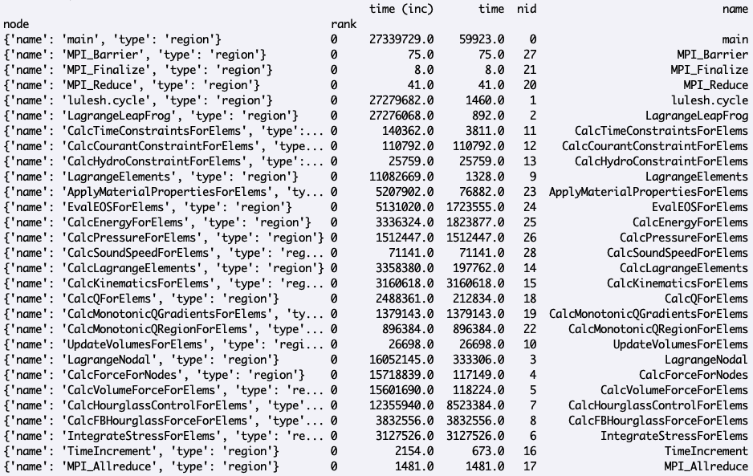
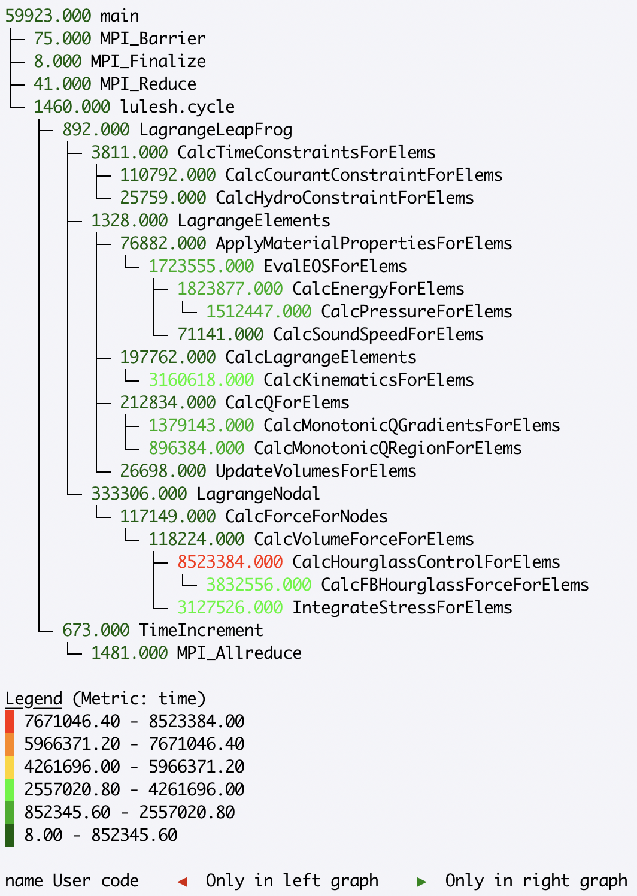

.. Copyright 2020-2021 University of Maryland and other Hatchet Project
   Developers. See the top-level LICENSE file for details.

   SPDX-License-Identifier: MIT

Basic Tutorial: Hatchet 101
===========================

This tutorial introduces how to use hatchet, including basics about:

* Installing hatchet
* Using the pandas API
* Using the hatchet API

Installing Hatchet and Tutorial Setup
-------------------------------------

You can install hatchet using pip:

.. code-block:: console

  $ pip install hatchet

After installing hatchet, you can import hatchet when running the Python
interpreter in interactive mode:

.. code-block:: console

  $ python
  Python 3.7.7 (default, Mar 14 2020, 02:39:01)
  [Clang 10.0.1 (clang-1001.0.46.4)] on darwin
  Type "help", "copyright", "credits" or "license" for more information.
  >>>

Typing ``import hatchet`` at the prompt should succeed without any error
messages:

.. code-block:: console

  >>> import hatchet as ht
  >>>

You are good to go!

The Hatchet repository includes stand-alone Python-based Jupyter notebook examples based on this
tutorial.
You can find them in the hatchet `GitHub repository
<https://github.com/hatchet/hatchet/tree/develop/docs/examples>`_. You can get a local copy of the repository using ``git``:

.. code-block:: console

  $ git clone https://github.com/hatchet/hatchet.git

You will find the tutorial notebooks in your local hatchet repository under
``docs/examples/tutorial/``.

Introduction
------------

You can read in a dataset into Hatchet for analysis by using one of several
``from_`` static methods. For example, you can read in a Caliper JSON file as
follows:

.. code-block:: console

  >>> import hatchet as ht
  >>> caliper_file = 'lulesh-annotation-profile-1core.json'
  >>> gf = ht.GraphFrame.from_caliper_json(caliper_file)
  >>>

At this point, your input file (profile) has been loaded into Hatchet's data
structure, known as a GraphFrame. Hatchet's GraphFrame contains a pandas
DataFrame and a corresponding graph.

The DataFrame component of Hatchet's GraphFrame contains the metrics and other
non-numeric data associated with each node in the dataset. You can print the
dataframe by typing:

.. code-block:: console

  >>> print(gf.dataframe)

This should produce output like this:

The Graph component of Hatchet's GraphFrame stores the connections between
parents and children. You can print the graph using hatchet's tree printing
functionality:

.. code-block:: console

  >>> print(gf.tree())

This will print a graphical version of the tree to the terminal:

Analyzing the DataFrame using pandas
------------------------------------

The ``DataFrame`` is one of two components that makeup the ``GraphFrame`` in
hatchet. The pandas ``DataFrame`` stores the performance metrics and other
non-numeric data for all nodes in the graph.

You can apply any pandas operations to the dataframe in hatchet. Note that
modifying the dataframe in hatchet outside of the hatchet API is not
recommended because operations that modify the dataframe can make the dataframe
and graph inconsistent.

By default, the rows in the dataframe are sorted in traversal order. Sorting
the rows by a different column can be done as follows:

.. code-block:: console

  >>> sorted_df = gf.dataframe.sort_values(by=['time'], ascending=False)

Individual numeric columns in the dataframe can be scaled or offset by a
constant using native pandas operations. In the following example, we add a new
column called ``scale`` to the existing dataframe, and print the dataframe
sorted by this new column from lowest to highest:

.. code-block:: console

  >>> gf.dataframe['scale'] = gf.dataframe['time'] * 4
  >>> sorted_df = gf.dataframe.sort_values(by=['scale'], ascending=True)

Analyzing the Graph via printing
--------------------------------

Hatchet provides several methods of visualizing graphs. In this section, we
show how a user can use the ``tree()`` method to convert the graph to a string
that can be displayed to standard output. This function has several different
parameters that can alter the output. To look at all the available parameters,
you can look at the docstrings as follows:

.. code-block:: console

  >>> help(gf.tree)

  Help on method tree in module hatchet.graphframe:

  tree(metric_column='time', precision=3, name_column='name', expand_name=False,
  context_column='file', rank=0, thread=0, depth=10000, highlight_name=False,
  invert_colormap=False) method of hatchet.graphframe.GraphFrame instance
      Format this graphframe as a tree and return the resulting string.

To print the graph output:

.. code-block:: console

  >>> gf.tree()

By default, the graph printout displays next to each node values in the
``time`` column of the dataframe. To display another column, change the
argument to the ``metric_column=`` parameter:

.. code-block:: console

  >>> gf.tree(metric_column='time (inc)')

To view a subset of the nodes in the graph, a user can change the ``depth=``
value to indicate how many levels of the tree to display. By default, all
levels in the tree are displayed. In the following example, we only ask to
display the first three levels of the tree, where the root is the first level:

.. code-block:: console

  >>> gf.tree(depth=3)

By default, the ``tree()`` method uses a red-green colormap, whereby nodes with
high metric values are colored red, while nodes with low metric values are
colored green. In some use cases, a user may want to reverse the colormap to
draw attention to certain nodes, such as performing a division of two
graphframes to compute speedup:

.. code-block:: console

  >>> gf.tree(invert_colormap=True)

For a dataset that contains rank- and/or thread-level data, the tree
visualization shows the metrics for rank 0 and thread 0 by default. To look at
the metrics for a different rank or thread, a user can change the ``rank=`` or
``thread=`` parameters:

.. code-block:: console

  >>> gf.tree(rank=4)

Analyzing the GraphFrame
------------------------

Depending on the input data file, the DataFrame may be initialized with
one or multiple index levels. In hatchet, the only required index level is
``node``, but some readers may also set ``rank`` and ``thread`` as additional
index levels. The index is a feature of pandas that is used to uniquely
identify each row in the Dataframe.

We can query the column names of the index levels as follows:

.. code-block:: console

  >>> print(gf.dataframe.index.names)

This will show the column names of the index levels in a list:

For this dataset, we see that there are two index columns: ``node`` and
``rank``. Since hatchet requires (at least) ``node`` to be an index level, we
can drop the extra ``rank`` index level, which will aggregate the data over all
MPI ranks at the per-node granularity.

.. code-block:: console

  >>> gf.drop_index_levels()
  >>> print(gf.dataframe)

This will aggregate over all MPI ranks and drop all index levels (except
``node``).

Now let's imagine we want to focus our analysis on a particular set of nodes.
We can filter the GraphFrame by some user-supplied function, which will
reduce the number of rows in the DataFrame as well as the number of nodes in
the graph. For this example, let's say we are only interested in nodes that
start with the name ``MPI_``.

.. code-block:: console

  >>> filt_func = lambda x: x['name'].startswith('MPI_')
  >>> filter_gf = gf.filter(filt_func, squash=True)
  >>> print(filter_gf.dataframe)

This will show a dataframe only containing those nodes that start with
``MPI_``:

.. figure:: images/basic-tutorial/11-graphframe-squash.png
   :scale: 50 %
   :align: right

By default, ``filter`` will make the graph consistent with the dataframe, so
the dataframe and the graph contain the same number of nodes. That is, we
specify ``squash=True``, so the graph and the dataframe are inconsistent. When
we print out the tree, we see that it has the same nodes as the filtered
dataframe:

Analyzing Multiple GraphFrames
------------------------------

With hatchet, we can perform mathematical operators on multiple GraphFrames.
This is useful for comparing the performance of functions at increasing
concurrency or computing speedup of two different implementations of the same
function, for example.

In the example below, we have two LULESH profiles collected at 1 and 64 cores
using Caliper. The graphs of these two profiles are slightly different
in structure. Due to the scale of the 64 core LULESH run, its profile contains
additional MPI-related functions than the 1 core run. With hatchet, we can
operate on profiles with different graph structures by first unifying the
graphs, and the resulting graph annotates the nodes to indicate which graph the
node originated from.

By dividing the profiles, we can analyze how the functions scale at higher
concurrencies. Before performing the division operator, we drop the extra
``rank`` index level in both profiles, which aggregates the data over all MPI
ranks at the per-node granularity. When printing the tree, we specify
``invert_colormap=True``, so that nodes with good speedup (i.e., low values)
are colored green, while nodes with poor speedup (i.e., high values) are
colored red. By default, nodes with low values are colored green, while high
values are colored red.

Additionally, because the 64 core profile contained more nodes than the 1 core
profile, the resulting tree is annotated with green triangles pointing to the
right, indicating that these nodes originally came from the *right* tree (when
thinking of gf3 = gf/gf2). In hatchet, those nodes contained in only one of the
two trees are initialized with a value of nan, and are colored in blue.

.. code-block:: console

  >>> caliper_file_1core = 'lulesh-annotation-profile-1core.json'
  >>> caliper_file_64cores = 'lulesh-annotation-profile-64cores.json'
  >>> gf = ht.GraphFrame.from_caliper_json(caliper_file_1core)
  >>> gf2 = ht.GraphFrame.from_caliper_json(caliper_file_64cores)
  >>> gf.drop_index_levels()
  >>> gf2.drop_index_levels()
  >>> gf3 = gf/gf2
  >>> gf3.tree(invert_colormap=True)

|pic1| / |pic2| = |pic3|

