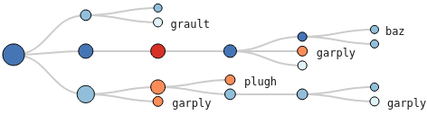
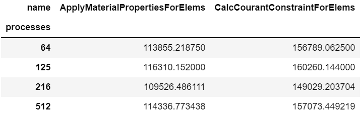
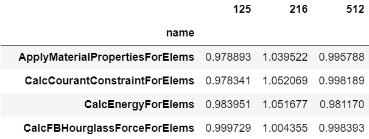

Chopper API
=====================

Analyzing a Single Execution
~~~~~~~~~~~~~~~~~~~~~~~~~~~~

**to_callgraph**: In some cases, the user may not need
performance metrics separated by the full calling context for each leaf node in
the CCT. In such cases, the CCT can be condensed or collapsed into a call graph
(by merging nodes with the same name), and analysis tasks can be performed on the call
graph data. The ``to_callgraph`` function automatically
converts a CCT to a call graph. This function merges CCT nodes based on their
node name, and aggregates the performance metrics using the sum operation to
create a single value of each metric for the merged node. This is applied to
each node in the GraphFrame, merging nodes and edges as needed to construct the
call graph representation of the CCT. This function outputs a new GraphFrame
with updated parent-child relationships in its graph object and aggregated
metric values on its DataFrame.

.. code-block:: python

  gf = GraphFrame.from_hpctoolkit("simple-cct")
  callgraph_graphframe = gf.to_callgraph()

.. image:: images/chopper/CG-toy.png
   :scale: 30 %
   :align: right

**load_imbalance**: Users are often interested in identifying load
imbalance in their programs so that they can fix the work distribution between
processes or threads. The ``load_imbalance`` function in Chopper allows studying
the load imbalance at the level of individual nodes in the CCT.

This function takes as input a GraphFrame, a metric on which to compute imbalance, 
and a threshold value to filter out inconsequential nodes. For each node in the CCT,
the mean and maximum metric values across all processes are calculated and 
then the maximum is divided by the mean value, which signifies the load
imbalance across processes. A large maximum-to-mean ratio for a metric
indicates heavy load imbalance. These calculations are performed by using
pandas DataFrame operations. The computed load imbalance value per node is
added as a new column in the DataFrame. The threshold parameter in
the function can be used to to filter out nodes that have metric values below a
threshold. This function outputs a new GraphFrame that has the same graph as
the input GraphFrame but a DataFrame that is sorted by the newly added load
imbalance column.

**hot_path**: A common operation performed by users when
analyzing a single execution is to examine the most time consuming call paths
in the program. Chopper enables finding the hot path in a CCT
starting at any node using a function call called ``hot_path``. The
``hot_path`` function takes as input -- a GraphFrame, a metric (and
optional threshold value), and a starting node. It traverses the graph starting
at the start node to until a stopping criterion is met. The criterion is to
find a node that accounts for more than a certain percent of the metric value
of its parent. Once this node is identified, the path from the starting node to
this node is referred to as the hot path.

The user can provide a starting node to examine a subset of the CCT. By
default, the function starts at the most time-consuming root node (in case of a forest).
A default percent value of 50% is used for the stopping condition. The user
can provide a different percent as the threshold parameter. The hot path output
by this function can be visualized using the interactive Jupyter visualization
in Hatchet in the context of the full tree.

.. code-block:: python

  gf = GraphFrame.from_hpctoolkit("simple-profile")
  hot_path = gf.hot_path()

.. image:: images/chopper/hot-path-toy2.png
   :scale: 30 %
   :align: right

The image shows the hot path for a toy CCT example. As
shown, the hot path can be found by calling a single function (line 2 in code
block). It then can be visualized by using Hatchet's Jupyter notebook
visualization. The red-colored path, which is highlighted by bigger nodes to
show hot nodes, represents the hot path. Most importantly, the user can 
interactively expand or collapse subtrees to investigate the CCT or call graph further.

Comparing Multiple Executions
~~~~~~~~~~~~~~~~~~~~~~~~~~~~~

**construct_from**: A user may need to ingest several datasets
for some analysis tasks. To automate this task, the ``construct_from`` function takes a list of datasets,
creates a GraphFrame for each, and returns a list of GraphFrames. Further, by
investigating the file extensions, JSON schemas, and other characteristics of
datasets that are unique to the output formats of different profiling tools, it
automatically detects the source tool of each dataset. It then uses the
appropriate data reader in Hatchet to correctly parse the data and create the
corresponding GraphFrames. Thus, it eliminates the need for the user to
identify the correct reader for a certain data format. Line 2 in the code
blocks shown below demonstrates how the ``construct_from`` function can be used to create
multiple GraphFrames objects at once using a list of datasets.

.. code-block:: python

  datasets = glob.glob("list_of_lulesh_profiles")
  graphframes = GraphFrame.construct_from(datasets)
  pivot_table = Chopper.multirun_analysis(graphframes)

**multirun_analysis**: Analyzing multiple executions together
typically requires comparing metric values of each node in the CCTs of different
executions. This can be quite cumbersome if attempted manually. This task is
automated with the ``multirun_analysis function``. It takes multiple GraphFrame objects and provides a
unified pivot table that rearranges the data to be indexed
by a unique identifier that identifies each execution called the pivot. For each execution, the pivot table contains
the metric values of each node in each GraphFrame.

The ``multirun_analysis`` function is quite flexible and provides options
to set the desired index, columns (e.g., node name, file, module), and metrics
to be used in the pivot table. Additionally, it enables setting a threshold
value to filter out the nodes that have metric values below the threshold. The code
block above for ``construct_from`` demonstrates how to use the
``multirun_analysis`` function with its default parameters (line 3) and
a pivot table it outputs. The pivot table is truncated for presentation
purposes.

The ``multirun_analysis`` function makes it straightforward to analyze
multiple executions and significantly reduces end user effort. Most
importantly, users can easily manipulate the pivot table programmatically or
generate a completely different one for different analysis tasks such as
scaling and variability.

**speedup_efficiency**: Speedup and efficiency are two
commonly used metrics to understand the scalability of parallel codes. The ``speedup_efficiency`` function
automates the task of calculating speedup and efficiency across several
executions on different process/thread counts. It calculates the speedup and efficiency
at per-node granularity. It takes multiple GraphFrames and returns a DataFrame
that either stores efficiency or speedup values for each node in the CCT
depending on the input parameters. This function utilizes the pivot table that
the ``multirun_analysis`` function outputs. Similarly, this function also
provides a parameter to set a threshold to enable filtering of unnecessary
nodes.

Speedup and efficiency have somewhat different expressions for weak and strong
scaling, thus, should be calculated separately. The
``speedup_efficiency`` function allows specifying the kind of
experiment performed by the user (weak or strong scaling) and the metric to compute (speedup or efficiency), and
performs the calculations accordingly.

An example DataFrame that contains the computed efficiency values for different LULESH weak
scaling executions (64 to 512 processes) can be seen in the image below
along with the corresponding code block (line 3). The user can easily utilize
the resulting DataFrame to plot the results.

.. code-block:: python

  datasets = glob.glob("list_of_lulesh_profiles")
  graphframes = GraphFrame.construct_from(datasets)
  efficiency = Chopper.speedup_efficiency(graphframes, weak=True, efficiency=True)

