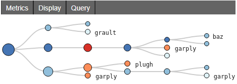

.. Copyright 2021-2024 University of Maryland and other Hatchet Project
   Developers. See the top-level LICENSE file for details.

   SPDX-License-Identifier: MIT

Chopper API
===========

Analyzing a Single Execution
~~~~~~~~~~~~~~~~~~~~~~~~~~~~

**to_callgraph**: For some analyses, the full calling context
of each function is not necessary. It may be more intuitive to examine the
*call graph* which merges all calls to the same function name into a single
node. The ``to_callgraph`` function converts a CCT into a call graph by
merging nodes representing the same function name and summing their associated
metric data. The output is a new GraphFrame where the graph has updated
(merged) caller-callee relationships and the DataFrame has aggregated metric
values.

.. code-block:: python

  import hatchet as ht
  %load_ext hatchet.vis.loader

  gf = ht.GraphFrame.from_literal(simple_cct)
  %cct gf # PerfTool's Jupyter CCT Visualization

  callgraph_graphframe = gf.to_callgraph()

**flatten**: This function is a generalized version of
``to_callgraph``. Rather than merging all nodes associated with the same
function name, it enables users to merge nodes by a different non-numeric
attribute, such as file name or load module. The user provides the column to
use and Chopper merges the nodes into a graph. The resulting graph is not a
call graph however as by definition, a call graph represents caller-callee
relationships between functions.

**load_imbalance**: Load imbalance is a
common performance problem in parallel programs. Developers and application
users are interested in identifying load imbalance so they can improve the
distribute of work among processes or threads. The ``load_imbalance``
function in Chopper makes it easier to study load imbalance at the level of
individual CCT nodes.

The input is a GraphFrame along with the metric on which to compute imbalance.
Optional parameters are a threshold value to filter out inconsequential nodes
and a flag for calculate detailed statistics about the load imbalance. The
output is a new GraphFrame with the same graph object but additional columns
in its DataFrame to describe load imbalance and optionally the verbose
statistics.

To calculate per-node load imbalance, pandas DataFrame operations are used to
compute the mean and maximum of the given metric across all processes. Load balance
is then the maximum divided by the mean. A large maximum-to-mean ratio indicates
heavy load imbalance. The per-node load imbalance value is added as a new column
in DataFrame.

The threshold parameter is used to filter out nodes with metric values below
the given threshold. This feature allows users to remove nodes that
might have high imbalance because their metric values are small. For example,
high load imbalance may not have significant impact on overall performance in
the time spent in the node is small.

The verbose option calculates additional load imbalance statistics. If
enabled, the function adds a new column to the resulting DataFrame with each
of the following: the top five ranks that have the highest metric values,
values of 0th, 25th, 50th, 75th, and 100th percentiles of each node, and the
number of processes in each of ten equal-sized bins between the
0th (minimum across processes) and 100th (maximum across processes) percentile
values.

.. code-block:: python

    import hatchet as ht

    gf = ht.GraphFrame.from_caliper("lulesh-512cores")
    gf = gf.load_imbalance(metric_column="time", verbose=True)
    print(gf.dataframe)

.. code-block:: python

    gf = ht.Chopper.load_imbalance(metric_column="time", verbose=True)

**hot_path**: A common task in analyzing a single execution
is to examine the most time-consuming call paths in the program or some subset
of the program. Chopper's ``hot_path``
function retrieves the hot path from any subtree of a CCT given its root. The
input parameters are the GraphFrame, metric (and optional stopping condition),
and the root of the subtree to search. Starting at the given subtree root, the
method traverses the graph it finds a node whose metric accounts for more than a
given percentage of that of its parent. This percentage is the stopping
condition.
The hot path is then the path between that node and the given subtree
root. The function outputs a list of nodes using which the DataFrame can
be manipulated.

By default, the ``hot_path`` function uses the most time-consuming root
node (in case of a forest) as the subtree root. The default stopping condition
is 50%. The resulting hot path can be visualized
in the context of the CCT using the interactive Jupyter visualization in
hatchet.

.. code-block:: python

  import hatchet as ht
  %load_ext hatchet.vis.loader
  
  gf = ht.GraphFrame.from_hpctoolkit("simple-profile")
  hot_path = gf.hot_path()
  %cct gf #Jupyter CCT visualiation

The image shows the hot path for a simple CCT example,
found with a single Chopper function call (line 5) and visualized using
hatchet's Jupyter notebook visualization (line 6).
The red-colored path with the large red nodes and additional labeling
represents the hot path. Users can interactively expand or collapse subtrees
to investigate the CCT further.

Comparing Multiple Executions
~~~~~~~~~~~~~~~~~~~~~~~~~~~~~

**construct_from**: Ingesting multiple datasets is the first
step to analyzing them. It is laborious and tedious to specify and load each profile
manually, which is necessary in hatchet. To alleviate this
problem, the ``construct_from`` function takes a list of datasets
and returns a list of GraphFrames, one for each dataset. Users can then
leverage Python's built-in functionalities to create the list from names and
structures inspected from the file system.

``construct_from`` automatically detects the data collection source of each
profile, using file extensions, JSON schemes, and other characteristics of the
datasets that are unique to the various output formats. This allows Chopper to
choose the appropriate data read in hatchet for each dataset, eliminating the
manual task of specifying each one.

.. code-block:: python

  datasets = glob.glob("list_of_lulesh_profiles")
  gfs = hatchet.GraphFrame.construct_from(datasets)
  table = hatchet.Chopper.multirun_analysis(gfs)
  print(table)

**multirun_analysis**: Analyzing across multiple executions
typically involves comparing metric values across the individual CCT nodes of
the different executions. Implementing this manually can be cumbersome,
especially as CCTs will differ between runs. This task is simplified with the
``multirun_analysis`` function.

By default, ``multirun_analysis`` builds a unified "pivot table" of the
multiple executions for a given metric. The index (or "pivot") is the
execution identifier. Per-execution, the metrics are also aggregated by the
function name. This allows users to quickly summarize across executions and
their composite functions for any metric.

``multirun_analysis`` allows flexibly setting the desired index, columns
(e.g., using file or module rather than function name), and metrics with which
to construct the pivot table. It also provides filtering of nodes below a
threshold value of the metric. The code block above for ``construct_from`` demonstrates
``multirun_analysis`` with default parameters (line 3) and its resulting table.

**speedup_efficiency**: Two commonly used metrics to
determine the scalability of parallel codes are *speedup* and *efficiency*.
The ``speedup_efficiency`` function simplifies the task of
calculating these metrics per CCT node across multiple executions with different process or
thread counts. Given multiple GraphFrames as input, ``speedup_efficiency`` creates a
new DataFrame with efficiency or speedup per CCT node, using ``unify_multiple_graphframes``
to unify the set of nodes. An optional parameter
allows users to set a metric threshold with which to exclude unnecessary nodes.

Speedup and efficiency have different expressions under the assumption of weak
or strong scaling. Thus, the ``speedup_efficiency`` functions should be
supplied with the type of experiment performed (weak or strong scaling) and
the metric of interest (speedup or efficiency).

The image below shows the output DataFrame of efficiency values from
a weak scaling (64 to 512 process) experiment of LULESH along with the
corresponding code block (line 3). The DataFrame can then be used directly to
plot the results.

.. code-block:: python

  datasets = glob.glob("list_of_lulesh_profiles")
  gfs = perftool.GraphFrame.construct_from(datasets)
  efficiency = perftool.Chopper.speedup_efficiency(gfs, weak=True, efficiency=True)
  print(efficiency.sort_values("512.time", ascending=True))
