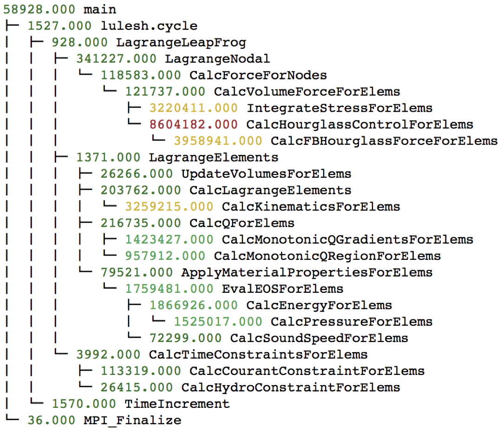
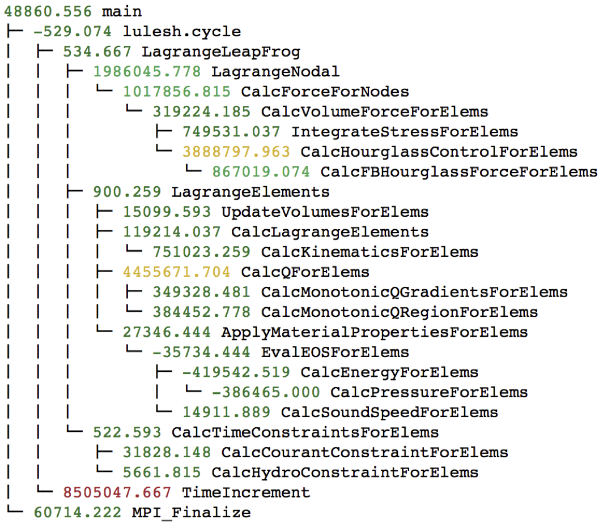

Analysis Examples
=================

In this section, we show how a user might leverage hatchet to perform simple
analyses of their execution profiles.

**Load imbalance**: With hatchet, we can compare the execution profiles of an
application launched across two different core counts. In this example, we ran
lulesh on 1 core and 27 cores, and wanted to identify the performance changes
as one scales on a node. We subtract the graphframe at 27 cores from the
graphframe at 1 core , and sort the resulting graphframe by execution time.

|pic1| - |pic2| = |pic3|

.. |pic2| image:: images/lulesh-27core.png
   :scale: 30 %

.. code-block:: python

    gf1 = GraphFrame()
    gf1.from_caliper('lulesh-1core.json')

    gf2 = GraphFrame()
    gf2.from_caliper('lulesh-27cores.json')
    gf2.drop_index_levels()

    gf3 = gf2 - gf1

.. image:: images/lulesh-diff-df.png
   :scale: 30 %
   :align: right
