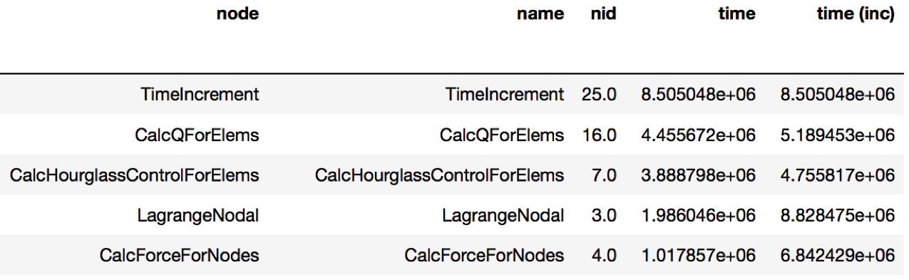

Analysis Examples
=================

Generating a flat profile
-------------------------

It is straightforward to generate a flat profile in hatchet by using the
``groupby`` functionality in pandas. The flat profile can be based on any
categorical column (e.g., function name, load module, file name).  We can
transform the tree or graph generated by a profiler into a flat profile by
specifying the column on which to apply the ``groupby`` operation and the
function to use for aggregation.  In the example below, we apply a pandas
``groupby`` operation on the ``name`` column.  Using a ``sum`` to aggregate
rows in a group gives us the time spent in each function. We then display the
resulting dataframe sorted by time.

.. image:: images/flat-function.png
   :scale: 30 %
   :align: right

.. code-block:: python

  gf = ht.GraphFrame.from_hpctoolkit('kripke')
  gf.drop_index_levels()

  grouped = gf.dataframe.groupby('name').sum()
  sorted_df = grouped.sort_values(by=['time'],
                                  ascending=False)
  print(sorted_df)

Identifying load imbalance
--------------------------

Hatchet makes it extremely easy to study load imbalance across processes or
threads at the per-node granularity (call site or function level).  A typical
metric to measure imbalance is to look at the ratio of the maximum and average
time spent in a code region across all processes.

We can identify the load imbalance at each node by perform a
``drop_index_levels`` operation on the GraphFrame in two different ways: by
providing mean as a function in one case and max as the function to another
copy of the DataFrame. This generates two DataFrames, one containing the
average time spent in each node, and the other containing the maximum time
spent in each node by any process. If we divide the corresponding columns of
the two DataFrames and look at the nodes with the highest value of the
max-to-average ratio, we have located the nodes with highest imbalance.

.. literalinclude:: ../examples/load-imbalance.py
   :language: python

.. image:: images/lulesh-load-imb.png
   :scale: 30 %

Comparing multiple executions
-----------------------------

An important task in parallel performance analysis is comparing the performance
of an application on two different thread counts or process counts.  The
filter, squash and subtract operations provided by the Hatchet API can be
extremely powerful in comparing profiling datasets from two executions.

In the example below, we ran LULESH on two core counts: 1 core and 27 cores,
and wanted to identify the performance changes as one scales on a node. We
subtract the graphframe at 27 cores from the graphframe at 1 core (after
dropping the additional index level), and sort the resulting graphframe by
execution time.

.. code-block:: python

  gf1 = ht.GraphFrame.from_caliper('lulesh-1core.json')
  gf2 = ht.GraphFrame.from_caliper('lulesh-27cores.json')

  gf2.drop_index_levels()
  gf3 = gf2 - gf1

  sorted_df = gf3.dataframe.sort_values(by=['time'], ascending=False)
  print(sorted_df)

Filtering by library
--------------------

Sometimes, users are interested in analyzing how a particular library such as
PetSc or MPI is used by their application and how the time spent in the library
changes as we scale to larger number of processes.

In this next example, we compare two datasets generated from executions at
different number of MPI processes. We read in two datasets of LULESH at 27 and
512 MPI processes respectively, and filter them both on the name column by
matching the names against ^MPI. After the filtering operation, we squash the
DataFrames to generate GraphFrames that just contain the MPI calls from the
original datasets. We can now subtract the squashed datasets to identify the
biggest offenders.

.. code-block:: python

  gf1 = GraphFrame.from_caliper('lulesh-27cores')
  gf1.drop_index_levels()
  filtered_gf1 = gf1.filter(lambda x: x['name'].startswith('MPI'))
  squashed_gf1 = filtered_gf1.squash()

  gf2 = GraphFrame.from_caliper('lulesh-512cores')
  gf2.drop_index_levels()
  filtered_gf2 = gf2.filter(lambda x: x['name'].startswith('MPI'))
  squashed_gf2 = filtered_gf2.squash()

  diff_gf = squashed_gf2 - squashed_gf1

  sorted_df = diff_gf.dataframe.sort_values(by=['time'], ascending=False)
  print(sorted_df)

.. image:: images/lulesh-mpi.png
   :scale: 40 %

Identifying scaling bottlenecks
-------------------------------

Hatchet can also be used to analyze data in a weak or strong scaling
performance study. In this example, we ran LULESH from 1 to 512 cores on third
powers of some numbers. We read in all the datasets into Hatchet, and for each
dataset, we use a few lines of code to filter the regions where the code spends
most of the time. We then use the pandas' pivot and plot operations to generate
a stacked bar chart that shows how the time spent in different regions of
LULESH changes as the code scales.

.. code-block:: python

  datasets = glob.glob('lulesh*.json')
  datasets.sort()

  dataframes = []
  for dataset in datasets:
      gf = ht.GraphFrame.from_caliper(dataset)
      gf.drop_index_levels()

      num_pes = re.match('(.*)-(\d+)(.*)', dataset).group(2)
      gf.dataframe['pes'] = num_pes
      filtered_gf = gf.filter(lambda x: x['time'] > 1e6)
      dataframes.append(filtered_gf.dataframe)

  result = pd.concat(dataframes)
  pivot_df = result.pivot(index='pes', columns='name', values='time')
  pivot_df.loc[:,:].plot.bar(stacked=True, figsize=(10,7))

.. image:: images/lulesh-plot.png
   :scale: 50 %
