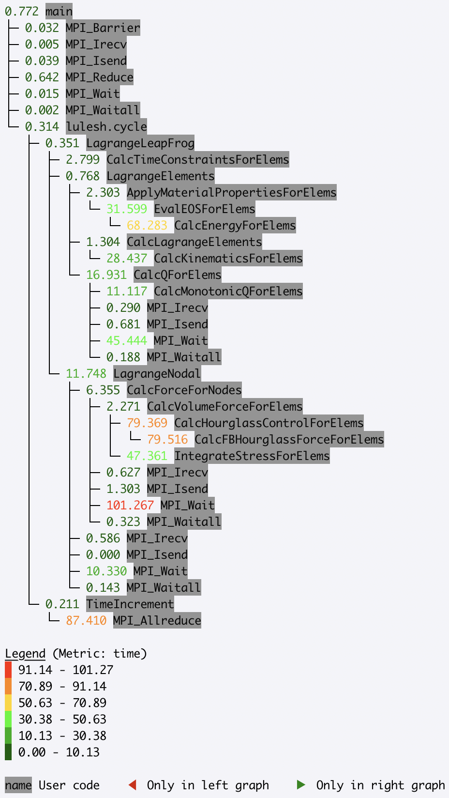

.. Copyright 2020 University of Maryland and other Hatchet Project
   Developers. See the top-level LICENSE file for details.

   SPDX-License-Identifier: MIT

Scaling Performance Examples
============================

Strong Scaling
--------------

Hatchet can be used for a strong scaling analysis of applications.  In this
example, we compare the performance of LULESH running on 1 and 64 cores.
By executing a simple ``divide`` of the two datasets in Hatchet, we can quickly
pinpoint bottleneck functions. In the resulting graph, we invert the color
scheme, so that functions that did not scale well (i.e., have a low speedup)
are colored in red.

.. code-block:: python

  gf_1core = ht.GraphFrame.from_caliper('lulesh*-1core.json')
  gf_64cores = ht.GraphFrame.from_caliper('lulesh*-64cores.json')

  gf_64cores["time"] *= 64

  gf_strong_scale = gf_1core / gf_64cores

|pic1| / |pic2|

= |pic3|

.. |pic1| image:: images/strong-scale-graph1.png
   :scale: 30 %

.. |pic3| image:: images/strong-scale-graph3.png
   :scale: 30 %

Weak Scaling
------------

Hatchet can be used for comparing parallel scaling performance of applications.
In this example, we compare the performance of LULESH running on 1 and 27 cores.
By executing a simple ``divide`` of the two datasets in Hatchet, we can quickly
identify which function calls did or did not scale well. In the resulting
graph, we invert the color scheme, so that functions that did not scale well
(i.e., have a low speedup) are colored in red.

.. code-block:: python

  gf_1core = ht.GraphFrame.from_caliper('lulesh*-1core.json')
  gf_27cores = ht.GraphFrame.from_caliper('lulesh*-27cores.json')

  gf_weak_scale = gf_1core / gf_27cores

|pic4| / |pic5|

= |pic6|

.. |pic4| image:: images/speedup-graph1.png
   :scale: 30 %

.. |pic5| image:: images/speedup-graph2.png
   :scale: 30 %

.. |pic6| image:: images/speedup-graph3.png
   :scale: 30 %
