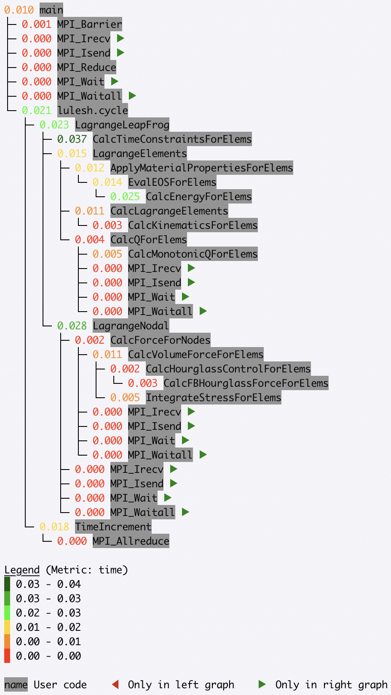
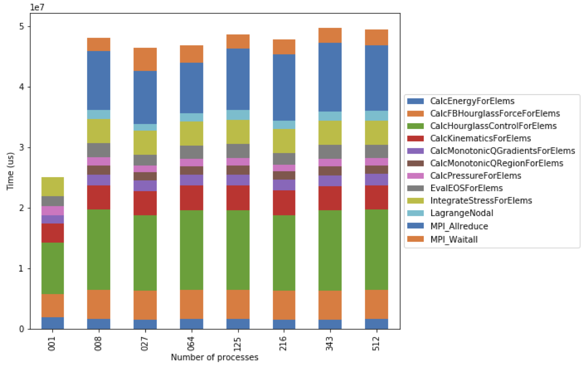

.. Copyright 2020 University of Maryland and other Hatchet Project
   Developers. See the top-level LICENSE file for details.

   SPDX-License-Identifier: MIT

Scaling Performance Examples
============================

Calculating strong scaling performance
--------------------------------------

Hatchet can be used for a strong scaling analysis of applications.  In this
example, we compare the performance of LULESH running on 1 and 64 cores.
By executing a simple ``divide`` of the two datasets in Hatchet, we can quickly
pinpoint bottleneck functions. In the resulting graph, we invert the color
scheme, so that functions that did not scale well (i.e., have a low speedup)
are colored in red.

.. code-block:: python

  gf_1core = ht.GraphFrame.from_caliper('lulesh*-1core.json')
  gf_64cores = ht.GraphFrame.from_caliper('lulesh*-64cores.json')

  gf_64cores["time"] *= 64

  gf_strong_scale = gf_1core / gf_64cores

|pic3| =

|pic1| / |pic2|

.. |pic1| image:: images/strong-scale-graph1.png
   :scale: 30 %

.. |pic2| image:: images/strong-scale-graph2.png
   :scale: 30 %

Calculating weak scaling performance
------------------------------------

Hatchet can be used for comparing parallel scaling performance of applications.
In this example, we compare the performance of LULESH running on 1 and 27 cores.
By executing a simple ``divide`` of the two datasets in Hatchet, we can quickly
identify which function calls did or did not scale well. In the resulting
graph, we invert the color scheme, so that functions that did not scale well
(i.e., have a low speedup) are colored in red.

.. code-block:: python

  gf_1core = ht.GraphFrame.from_caliper('lulesh*-1core.json')
  gf_27cores = ht.GraphFrame.from_caliper('lulesh*-27cores.json')

  gf_weak_scale = gf_1core / gf_27cores

|pic6| =

|pic4| / |pic5|

.. |pic4| image:: images/weak-scale-graph1.png
   :scale: 30 %

.. |pic5| image:: images/weak-scale-graph2.png
   :scale: 30 %

.. |pic6| image:: images/weak-scale-graph3.png
   :scale: 30 %

Identifying scaling bottlenecks
-------------------------------

Hatchet can also be used to analyze data in a weak or strong scaling
performance study. In this example, we ran LULESH from 1 to 512 cores on third
powers of some numbers. We read in all the datasets into Hatchet, and for each
dataset, we use a few lines of code to filter the regions where the code spends
most of the time. We then use the pandas' pivot and plot operations to generate
a stacked bar chart that shows how the time spent in different regions of
LULESH changes as the code scales.

.. code-block:: python

  datasets = glob.glob('lulesh*.json')
  datasets.sort()

  dataframes = []
  for dataset in datasets:
      gf = ht.GraphFrame.from_caliper(dataset)
      gf.drop_index_levels()

      num_pes = re.match('(.*)-(\d+)(.*)', dataset).group(2)
      gf.dataframe['pes'] = num_pes
      filtered_gf = gf.filter(lambda x: x['time'] > 1e6)
      dataframes.append(filtered_gf.dataframe)

  result = pd.concat(dataframes)
  pivot_df = result.pivot(index='pes', columns='name', values='time')
  pivot_df.loc[:,:].plot.bar(stacked=True, figsize=(10,7))

We use the same LULESH scaling datasets above to filter for time-consuming
functions that start with the string ``Calc``. This data is used to produce a
line chart showing the performance of each function as the number of processes
is increased. One of the functions (``CalcMonotonicQRegionForElems``) does not
occur until the number of processes is greater than 1.

.. code-block:: python

  datasets = glob.glob('lulesh*.json')
  datasets.sort()

  dataframes = []
  for dataset in datasets:
      gf = ht.GraphFrame.from_caliper(dataset)
      gf.drop_index_levels()

      num_pes = re.match('(.*)-(\d+)(.*)', dataset).group(2)
      gf.dataframe['pes'] = num_pes
      filtered_gf = gf.filter(lambda x: x["time"] > 1e6 and x["name"].startswith('Calc'))
      dataframes.append(filtered_gf.dataframe)

  result = pd.concat(dataframes)
  pivot_df = result.pivot(index='pes', columns='name', values='time')
  pivot_df.loc[:,:].plot.line(figsize=(10, 7))

.. image:: images/lulesh-line-plot.png
   :scale: 50 %
