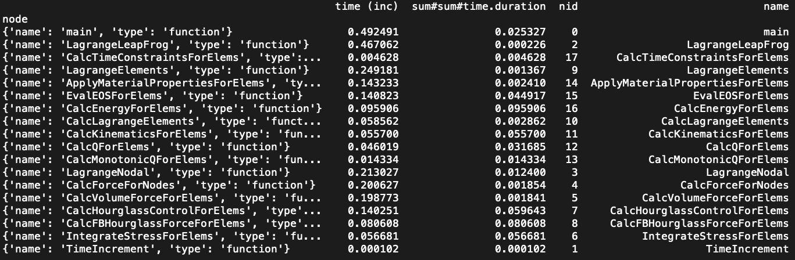
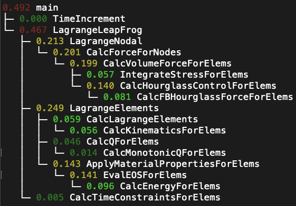

Start Tutorial
--------------

Read in a sample dataset into hatchet
~~~~~~~~~~~~~~~~~~~~~~~~~~~~~~~~~~~~~

To start, we run a basic example to read in a dataset into a GraphFrame. This
example reads in a sample dataset, and prints out the resulting DataFrame and
Graph.

:download:`Python Source <../examples/simple/caliper_cali.py>`

.. literalinclude::
   ../examples/simple/caliper_cali.py
   :language: python
   :lines: 1-

   The DataFrame component of Hatchet's GraphFrame containing the metadata of
   each node in the Caliper cali dataset.

   The Graph component of Hatchet's GraphFrame defining the connections between
   parent and child(ren).
