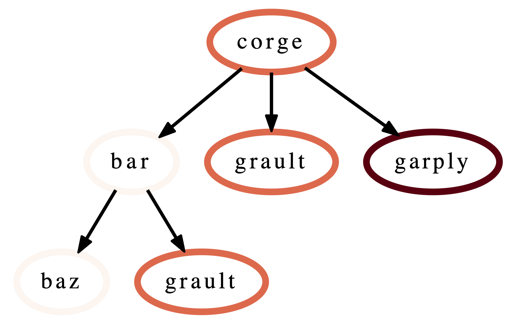

.. Copyright 2017-2021 Lawrence Livermore National Security, LLC and other
   Hatchet Project Developers. See the top-level LICENSE file for details.

   SPDX-License-Identifier: MIT

**********
User Guide
**********

Hatchet is a Python tool that simplifies the process of analyzing hierarchical
performance data such as calling context trees. Hatchet uses pandas dataframes
to store the data on each node of the hierarchy and keeps the graph
relationships between the nodes in a different data structure that is kept
consistent with the dataframe.

Data structures in hatchet
==========================

Hatchet's primary data structure is a ``GraphFrame``, which combines a
structured index in the form of a graph with a pandas dataframe.  The images
on the right show the two objects in a ``GraphFrame`` – a ``Graph`` object (the
index), and a ``DataFrame object`` storing the metrics associated with each
node.

**Graphframe** stores the performance data that is read in from an HPCToolkit
database, Caliper Json or Cali file, or gprof/callgrind DOT file. Typically,
the raw input data is in the form of a tree. However, since subsequent
operations on the tree can lead to new edges being created which can turn the
tree into a graph, we store the input data as a directed graph. The graphframe
consists of a graph object that stores the edge relationships between nodes and
a dataframe that stores different metrics (numerical data) and categorical data
associated with each node.

.. image:: images/sample-dataframe.png
   :scale: 35 %
   :align: right

**Graph**: The graph can be connected or disconnected (multiple roots) and each
node in the graph can have one or more parents and children. The node stores
its frame, which can be defined by the reader. The call path is derived by
appending the frames from the root to a given node.

**Dataframe**: The dataframe holds all the numerical and categorical data
associated with each node. Since typically the call tree data is per process, a
multiindex composed of the node and MPI rank is used to index into the
dataframe.

Reading in a dataset
====================

One can use one of several static methods defined in the GraphFrame class to
read in an input dataset using hatchet. For example, if a user has an
HPCToolkit database directory that they want to analyze, they can use the
``from_hpctoolkit`` method:

.. code-block:: python

  import hatchet as ht

  if __name__ == "__main__":
      dirname = "hatchet/tests/data/hpctoolkit-cpi-database"
      gf = ht.GraphFrame.from_hpctoolkit(dirname)

Similarly if the input file is a split-JSON output by Caliper, they can use
the ``from_caliper_json`` method:

.. code-block:: python

  import hatchet as ht

  if __name__ == "__main__":
      filename = ("hatchet/tests/data/caliper-lulesh-json/lulesh-sample-annotation-profile.json")
      gf = ht.GraphFrame.from_caliper_json(filename)

Examples of reading in other file formats can be found in
:doc:`Analysis Examples <analysis_examples>`.

Visualizing the data
====================

When the graph represented by the input dataset is small, the user may be interested in visualizing it in entirety or a portion of it. Hatchet provides several mechanisms to visualize the graph in hatchet. One can use the ``tree()`` function to convert the graph into a string that can be printed on standard output:

.. code-block:: python

  print(gf.tree())

One can also use the ``to_dot()`` function to output the tree as a string in the Graphviz' DOT format. This can be written to a file and then used to display a tree using the ``dot`` or ``neato`` program.

.. image:: images/vis-dot.png
   :scale: 25 %
   :align: right

.. code-block:: python

  with open("test.dot", "w") as dot_file:
      dot_file.write(gf.to_dot())

.. code-block:: console

  $ dot -Tpdf test.dot > test.pdf

One can also use the ``to_flamegraph`` function to output the tree as a string
in the folded stack format required by flamegraph. This file can then be used to
create a flamegraph using ``flamegraph.pl``.

.. code-block:: python

  with open("test.txt", "w") as folded_stack:
      folded_stack.write(gf.to_flamegraph())

.. code-block:: console

  $ ./flamegraph.pl test.txt > test.svg

One can also print the contents of the dataframe to standard output:

.. code-block:: python

  pd.set_option("display.width", 1200)
  pd.set_option("display.max_colwidth", 20)
  pd.set_option("display.max_rows", None)

  print(gf.dataframe)

If there are many processes or threads in the dataframe, one can also print
a cross section of the dataframe, say the values for rank 0, like this:

.. code-block:: python

  print(gf.dataframe.xs(0, level="rank"))

One can also view the graph in Hatchet's interactive visualization for Jupyter.
In the Jupyter visualization shown below, users can explore their data by using
their mouse to select and hide nodes. For those nodes selected, a table in the
the upper right will display the metadata for the node(s) selected. The
interactive visualization capability is still in the research stage, and is
under development to improve and extend its capabilities. Currently, this
feature is available for the literal graph/tree format, which is specified as a
list of dictionaries. More on the literal format can be seen `here
<https://hatchet.readthedocs.io/en/latest/analysis_examples.html>`_.

.. code-block:: python

  roundtrip_path = "hatchet/external/roundtrip/"
  %load_ext roundtrip
  literal_graph = [ ... ]
  %loadVisualization roundtrip_path literal_graph

.. image:: images/jupyter-tree-overview.png
   :scale: 70 %
   :align: center

Once the user has explored their data, the interactive visualization outputs
the corresponding call path query of the selected nodes.

.. code-block:: python

  %fetchData myQuery
  print(myQuery)  # displays [{"name": "corge"}, "*"] for the selection above

This query can then be integrated into future workflows to automate the
filtering of the data by the desired query in a Python script. For the
selection above, we save the resulting query as a string and pass it to
Hatchet's ``filter()`` function to filter the input literal graph. An example
code snippet is shown below, with the resulting filtered graph shown on the
right.

.. code-block:: python

  myQuery = [{"name": "corge"}, "*"]
  gf = ht.GraphFrame.from_literal(literal_graph)
  filter_gf = gf.filter(myQuery)

An example notebook of the interactive visualization can be found in the
`docs/examples/tutorials` directory.

Dataframe operations
====================

.. image:: images/sample-dataframe.png
   :scale: 40 %
   :align: right

**filter**: ``filter`` takes a user-supplied function or query object and
applies that to all rows in the DataFrame. The resulting Series or DataFrame is
used to filter the DataFrame to only return rows that are true. The returned
GraphFrame preserves the original graph provided as input to the filter
operation.

.. code-block:: python

  filtered_gf = gf.filter(lambda x: x['time'] > 10.0)

The images on the right show a DataFrame before and after a filter
operation.

.. image:: images/filter-dataframe.png
   :scale: 40 %
   :align: right

An alternative way to filter the DataFrame is to supply a query path in the
form of a query object. A query object is a list of *abstract graph nodes* that
specifies a call path pattern to search for in the GraphFrame. An *abstract
graph node* is made up of two parts:

* A wildcard that specifies the number of real nodes to match to the abstract
  node. This is represented as either a string with value "." (match one node),
  "*" (match zero or more nodes), or "+" (match one or more nodes) or an integer
  (match exactly that number of nodes). By default, the wildcard is "." (or 1).
* A filter that is used to determine whether a real node matches the abstract
  node. In the high-level API, this is represented as a Python dictionary keyed
  on column names from the DataFrame. By default, the filter is an "always true"
  filter (represented as an empty dictionary).

The query object is represented as a Python list of abstract nodes. To specify
both parts of an abstract node, use a tuple with the first element being the
wildcard and the second element being the filter.  To use a default value for
either the wildcard or the filter, simply provide the other part of the
abstract node on its own (no need for a tuple). The user **must** provide at
least one of the parts of the above definition of an abstract node.

..
  For more
  information on Hatchet's graph query language, including how to use the
  low-level API, look at the :doc:`expanded query language documentation
  <./query_language_guide>`.

The query language example below looks for all paths that match first a single
node with name `solvers`, followed by 0 or more nodes with an inclusive time
greater than 10, followed by a single node with name that starts with `p` and
ends in an integer and has an inclusive time greater than or equal to 10. When
the query is used to filter and squash the the graph shown on the right, the
returned GraphFrame contains the nodes shown in the table on the right.

..
    TODO
    This bar is added to try to force the sample-graph.png and
    query-dataframe.png images to be placed one above the other.
    If anyone can find a better way to do this, please change it.
|

.. image:: images/query-dataframe.png
   :scale: 35 %
   :align: right

Filter is one of the operations that leads to the graph object and DataFrame
object becoming inconsistent. After a filter operation, there are nodes in the
graph that do not return any rows when used to index into the DataFrame.
Typically, the user will perform a squash on the GraphFrame after a filter
operation to make the graph and DataFrame objects consistent again. This can be
done either by manually calling the ``squash`` function on the new GraphFrame
or by setting the ``squash`` parameter of the ``filter`` function to ``True``.

.. code-block:: python

  query = [
      {"name": "solvers"},
      ("*", {"time (inc)": "> 10"}),
      {"name": "p[a-z]+[0-9]", "time (inc)": ">= 10"}
  ]

  filtered_gf = gf.filter(query)

**drop_index_levels**: When there is per-MPI process or per-thread
data in the DataFrame, a user might be interested in aggregating the data in
some fashion to analyze the graph at a coarser granularity. This function
allows the user to drop the additional index columns in the hierarchical index
by specifying an aggregation function. Essentially, this performs a
``groupby`` and ``aggregate`` operation on the DataFrame. The user-supplied
function is used to perform the aggregation over all MPI processes or threads
at the per-node granularity.

.. code-block:: python

  gf.drop_index_levels(function=np.max)

**update_inclusive_columns**: When a graph is rewired (i.e., the
parent-child connections are modified), all the columns in the DataFrame that
store inclusive values of a metric become inaccurate. This function performs a
post-order traversal of the graph to update all columns that store inclusive
metrics in the DataFrame for each node.

Graph operations
================

**traverse**: A generator function that performs a pre-order traversal of the
graph and generates a sequence of all nodes in the graph in that order.

**squash**: The ``squash`` operation is typically performed by the user after a
``filter`` operation on the DataFrame.  The squash operation removes nodes from
the graph that were previously removed from the DataFrame due to a filter
operation. When one or more nodes on a path are removed from the graph, the
nearest remaining ancestor is connected by an edge to the nearest remaining
child on the path. All call paths in the graph are re-wired in this manner.

.. image:: images/squash-graph.png
   :scale: 30 %
   :align: right

A squash operation creates a new DataFrame in addition to the new graph. The
new DataFrame contains all rows from the original DataFrame, but its index
points to nodes in the new graph. Additionally, a squash operation will make
the values in all columns containing inclusive metrics inaccurate, since the
parent-child relationships have changed. Hence, the squash operation also calls
``update_inclusive_columns`` to make all inclusive columns in the DataFrame
accurate again.

.. code-block:: python

  filtered_gf = gf.filter(lambda x: x['time'] > 10.0)
  squashed_gf = filtered_gf.squash()

**equal**: The ``==`` operation checks whether two graphs have the same nodes
and edge connectivity when traversing from their roots.  If they are
equivalent, it returns true, otherwise it returns false.

**union**: The ``union`` function takes two graphs and creates a unified graph,
preserving all edges structure of the original graphs, and merging nodes with
identical context.  When Hatchet performs binary operations on two GraphFrames
with unequal graphs, a union is performed beforehand to ensure that the graphs
are structurally equivalent.  This ensures that operands to element-wise
operations like add and subtract, can be aligned by their respective nodes.

GraphFrame operations
=====================

**copy**: The ``copy`` operation returns a shallow copy of a GraphFrame.  It
creates a new GraphFrame with a copy of the original GraphFrame's DataFrame,
but the same graph.  As mentioned earlier, graphs in Hatchet use immutable
semantics, and they are copied only when they need to be restructured.  This
property allows us to reuse graphs from GraphFrame to GraphFrame if the
operations performed on the GraphFrame do not mutate the graph.

**deepcopy**: The ``deepcopy`` operation returns a deep copy of a GraphFrame.
It is similar to ``copy``, but returns a new GraphFrame with a copy of the
original GraphFrame's DataFrame and a copy of the original GraphFrame's graph.

**unify**: ``unify`` operates on GraphFrames, and calls union on the two
graphs, and then reindexes the DataFrames in both GraphFrames to be indexed by
the nodes in the unified graph.  Binary operations on GraphFrames call unify
which in turn calls union on the respective graphs.

**add**: Assuming the graphs in two GraphFrames are equal, the ``add (+)``
operation computes the element-wise sum of two DataFrames.  In the case where
the two graphs are not identical, ``unify`` (described above) is applied first
to create a unified graph before performing the sum.  The DataFrames are copied
and reindexed by the combined graph, and the add operation returns new
GraphFrame with the result of adding these DataFrames. Hatchet also provides an
in-place version of the add operator: ``+=``.

**subtract**:  The subtract operation is similar to the add operation in that
it requires the two graphs to be identical.  It applies ``union`` and reindexes
DataFrames if necessary.  Once the graphs are unified, the subtract operation
computes the element-wise difference between the two DataFrames.  The subtract
operation returns a new GraphFrame, or it modifies one of the GraphFrames in
place in the case of the in-place subtraction (``-=``).

.. code-block:: python

  gf1 = ht.GraphFrame.from_literal( ... )
  gf2 = ht.GraphFrame.from_literal( ... )
  gf2 -= gf1

|pic1| - |pic2| = |pic3|

.. |pic2| image:: images/diff-graph1.png
   :scale: 30 %

**tree**: The ``tree`` operation returns the graphframe's graph structure as a
string that can be printed to the console. By default, the tree uses the
``name`` of each node and the associated ``time`` metric as the string
representation. This operation uses automatic color by default, but True or
False can be used to force override.
